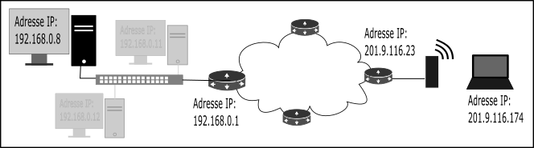
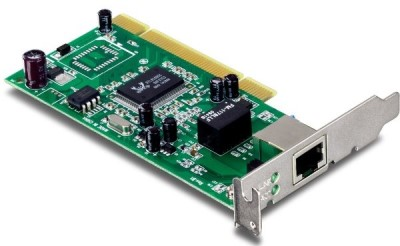
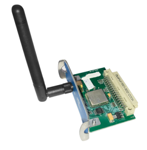

.. TNSI

.. toctree::
   :maxdepth: 1

Architecture réseau
===================

Réseau local (LAN)
------------------

Un réseau local est un ensemble d'appareils qui sont reliés entre eux et pouvant s'envoyer et recevoir des données. Au delà de 2 machines, la connexion ne peut pas se faire directement entre les appareils et
nécessite un **switch** qui permet de connecter plusieurs appareils.

.. image:: ../img/lan_1.png
   :align: center
   :width: 480

Protocole
---------

Un **protocole** est un ensemble de règles qui permettent d'établir, mener et terminer une communication entre deux appareils.

Pour communiquer, les machines doivent suivent des règles qui leurs permettent :

- de communiquer, c'est à dire qu'elles peuvent s'envoyer et recevoir des données;
- d'être identifiées pour que les données soient envoyées sans erreur aux bonnes machines;
- de s'assurer que toutes les données sont bien arrivées et dans l'ordre;
- d'utiliser des applications utilisant le réseau comme un navigateur web.

Lorsque les machines sont reliées à un réseau local, le protocole réseau **ethernet** utilisant les adresses
matérielles MAC permet aux machines d'être identifiées sur le réseau local.

Internet
--------

Le mot **internet** est un mot valise issu de l'anglais **interconnected** **network** et qui signifie
**interconnexion de réseaux**.

Si 2 machines n'appartiennent pas à un même réseau mais souhaitent communiquer entre elles, il faut un modèle qui relie les deux réseaux distants. C'est le modèle internet.

Internet utilise le protocole de communication IP. Chaque machine se voit attribuer dans son réseau local une adresse logique en IPv4 et en IPv6 qui lui permet d'être identifiée de façon unique sur le réseau.

Un **réseau** est caractérisé par 2 adresses IP : l'**adresse réseau** et le **masque de réseau**. 

Le masque de réseau détermine le nombre maximum d'adresses IP qui pourront être utilisées sur un réseau. Ce masque définit aussi la plage d'adresses à utiliser dans le réseau.

Le masque de réseau (en IPv4) est une adresse de 32 bits constituée d'une suite de bits tous égaux à 1 suivis de bits tous égaux à 0. Il se note en décimal sur 4 octets ou au format CIDR c'est à dire un nombre qui donne la quantitié de bits égaux à 1.

.. admonition:: Exemple

   Soit un réseau d'adresse ``192.168.0.0`` de masque de réseau ``255.255.255.0``.

   En binaire, le masque de réseau est : ``11111111.11111111.11111111.00000000`` ce qui signifie qu'il y a 24 bits égaux à 1.

   On peut donc noter l'adresse réseau et son masque par ``192.168.0.0/24``

   Ce masque permet d'avoir sur le réseau :math:`2^{8}=256` adresses IP distinctes.

Lorsqu'on connaît l'adresse IP d'une machine dans un réseau local et le masque de réseau, il est possible en appliquant un ET binaire, bit par bit, d'obtenir l'adresse du réseau.

.. admonition:: Exemple

   Une machine a pour adresse IPv4 : 192.168.15.24/23

   L'adresse ``192.168.15.24`` se note ``11000000.10101000.00001111.00011000`` en binaire et le masque se
   note ``11111111.11111111.11111110.00000000``.

   L'application d'un ET binaire entre ces 2 adresses nous donne l'adresse du réseau:

   .. figure:: ../img/et-binaire.png
      :align: center
      :width: 420
      
   L'adresse du réseau est donc ``192.168.14.0`` et contient :math:`2^{9}=512` adresses IP.

Une machine dans un réseau local connait les adresses IP de plusieurs services réseau:

- L'adresse IP de **broadcast** ou **diffusion** qui permet d'envoyer un message à toutes les machines du réseau en même temps;
- L'adresse IP de la **passerelle** ou **routeur** pour accéder à d'autres réseaux (internet);
- L'adresse des serveurs présents sur le réseau comme le serveur DHCP qui attribue automatiquement les adresses IP aux machines du réseau;
- L'adresse IP du serveur DNS qui effectue la résolution des noms de domaine, c'est à dire transforme un nom de domaine en adresse IP;

Le second rôle du protocole IP est le routage des données à travers différents réseaux.

Il assure la communication entre deux réseaux distants avec des **routeurs** qui ont des adresses en IPv4 et IPv6 pour communiquer avec les machines de chaque réseau et entre les réseaux.

.. figure:: ../img/lan_1_et_2.png
   :align: center
   :width: 560

L'adresse IP du routeur dans un réseau local qui permet de le relier à internet est appelée **passerelle** ou **gateway** en anglais.

La transmission de données sur internet
---------------------------------------

On décompose en 4 couches la transmission de données sur internet:

- La couche **liaison** qui utilise les adresses physiques des interfaces réseaux;
- La couche **internet** qui utilise le protocole IP et les adresses logiques en IPv4 et IPv6;
- La couche **transport** qui utilise le protocole TCP (ou UDP) 
- La couche **application** qui utilise les protocoles des programmes utilisés.

.. rubric:: Couche liaison

Une **interface réseau** est le moyen pour une machine (ordinateur, tablette, imprimante) d'envoyer et recevoir des données vers un autre appareil lui aussi équipé d'une interface réseau.
Cette interface peut être reliée physiquement par un câble ou accessible par des ondes comme le wifi.

   

Une **interface réseau** possède une adresse matérielle ou adresse MAC (Material Access Control) qui est unique. Une partie de cette adresse est associée au constructeur de l'interface.

Elle se code sur 6 octets notés en hexadécimal. Par exemple, ``dc:a6:32:42:1a:23`` est
l'adresse MAC de la carte réseau d'un raspberry Pi.

Lors de la transmission de données sur le réseau, les adresses physiques de la source et du destinaire sont ajoutées aux données à transmettre.

.. rubric:: Couche internet

Pour mener à bien la transmission des données, celles-ci sont encapsulées dans un paquet IP qui contient en plus des données à transmettre l'adresse IP source et l' adresse IP du destinataire.

- L'adresse IP source sera celle de la passerelle, soit l'adresse du routeur qui relie le réseau à internet. Le routeur transmet les données à la machine du réseau qui envoie et reçoit les données.
- L'adresse IP destinataire est celle du serveur qui se trouve sur internet.

.. rubric:: Couche transport

La couche **transport** assure, via le protocole TCP, le bon acheminement des données pour être utilisés par les programmes.

- Le protocole TCP s'assure que les paquets IP arrivent au bon programme;
- Le protocole TCP s'assure que les paquets IP sont tous arrivés.

En pratique, une machine dans un réseau exécute des programmes et sollicite un service réseau. Si le protocole IP assure la communication avec les adresses IP, comment les données arrivent-elles aux bons
programmes ? C'est le rôle de la couche transport et du protocole TCP. Celui-ci ajoute aux paquets IP deux nombres : les **numéros de port**.

- un **port source** pour identifier le programme qui demande le service;
- un **port destinataire** pour identifier le programme sur le serveur qui reçoit la demande.

Les paquets IP sont donc encapsulés et deviennent des **datagrammes** qui contiennent le port source, le port destinataire et le paquet IP.

.. note::

   Les ports compris entre 0 et 1024 sont réservés pour des services réseaux. Les ports 80 et 443 pour le web, le port 53 pour le DNS et le port 67 pour le serveur DHCP.

.. rubric:: Couche application

C'est la couche la plus haute et elle concerne les différents programmes qui ont besoin de données situées sur le réseau ou internet.

.. admonition:: Exemple

   On souhaite afficher la page web : https://fr.wikipedia.org/

   - Une requête au serveur DNS est envoyée. C'est la couche Application.
   - Le protocole TCP de la couche transport crée un datagramme en ajoutant les ports dont le 53 comme port de destination;
   - Le protocole IP de la couche internet crée un paquet IP en ajoutant au datagramme les adresses IP de la machine source et du serveur DNS.
   - Le protocole ethernet de la couche liaison crée une trame en ajoutant les adresses matérielles (MAC) des interfaces réseaux.

   .. figure:: ../img/couches.png
      :align: center
      :width: 400
